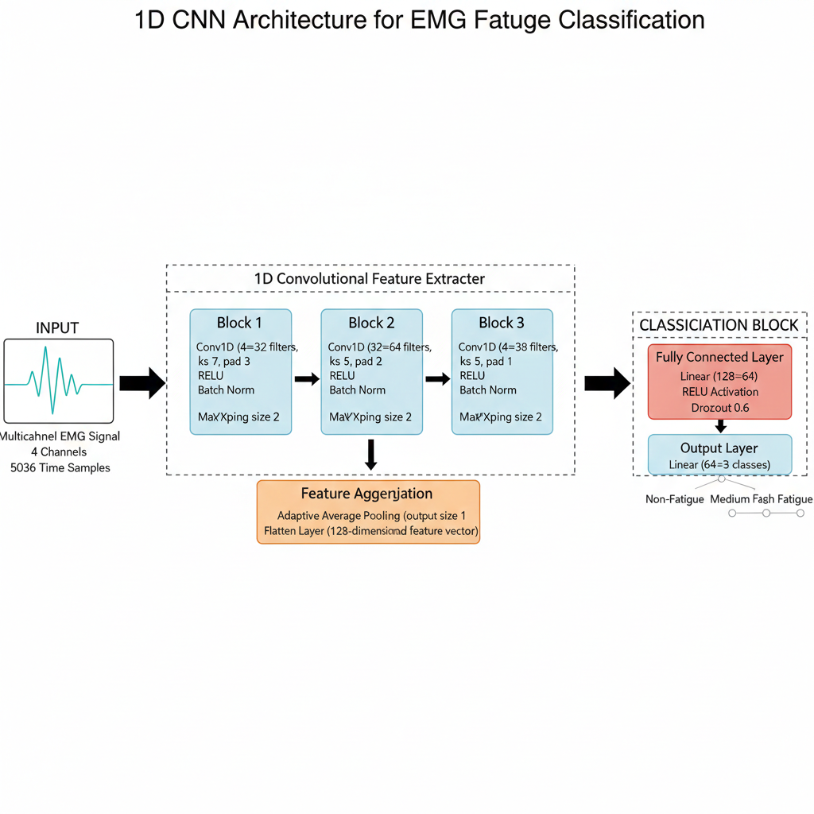
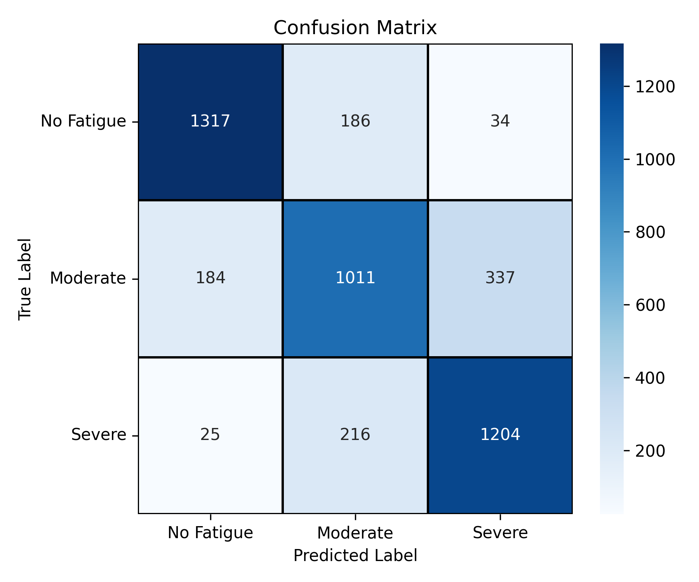

# EMG-Based Muscle Fatigue Classification Using Deep Learning

Muscle fatigue detection is a critical component in modern biomedical engineering applications, including rehabilitation monitoring, injury prevention, ergonomic assessment, and human–machine interaction. Surface electromyography (sEMG) provides a non-invasive mechanism to measure muscle activity; however, accurate fatigue classification from raw EMG signals remains challenging due to signal variability, noise, inter-subject differences, and subjective labeling.

This project presents a complete deep learning pipeline for automatic classification of muscle fatigue levels from raw multichannel EMG signals using a one-dimensional convolutional neural network (1D-CNN).

---

## Problem Statement

Traditional EMG fatigue detection methods rely heavily on frequency-domain features such as median frequency and mean power frequency. These approaches require manual feature engineering and struggle to generalize across subjects and movement conditions.

This project develops an automated, data-driven fatigue classification system capable of:
- Learning discriminative fatigue patterns directly from raw EMG signals
- Handling noisy and non-stationary biomedical time-series data
- Providing robust classification across multiple participants and movement trials

**Three fatigue classes:**
| Class | Label |
|-------|-------|
| 0 | Non-Fatigue |
| 1 | Moderate Fatigue |
| 2 | High Fatigue |

---

## Dataset

Surface EMG recordings from healthy adult participants performing dynamic upper-limb movements.

| Property | Value |
|----------|-------|
| Participants | 13 |
| Muscles recorded | 4 per arm (multichannel) |
| Sampling frequency | 1259 Hz |
| Label frequency | 50 Hz |
| Fatigue classes | 3 (Non, Moderate, High) |

**Dataset Source:** [EMG Muscle Fatigue Dataset — Zenodo](https://zenodo.org/records/14182446)

---

## Methodology

### Signal Preprocessing
- Band-pass filtering: 20 Hz – 450 Hz (removes motion artifacts and noise)
- Segmentation into 4-second fixed-length windows
- 50% overlap between consecutive windows
- Removal of transition regions near fatigue label changes to reduce label noise
- Per-window z-score normalization

### Model Architecture

A lightweight 1D-CNN designed to extract temporal features from multichannel EMG signals.

| Layer | Details |
|-------|---------|
| Conv1D | 4 → 32 filters, kernel size 7 |
| Conv1D | 32 → 64 filters, kernel size 5 |
| Conv1D | 64 → 128 filters, kernel size 3 |
| Pooling | Max pooling + Adaptive average pooling |
| FC | 128 → 64, ReLU, Dropout |
| Output | 64 → 3 classes, Softmax |

Total trainable parameters: ~45,000



### Training Strategy
- Stratified train/validation/test split
- Hyperparameter optimization via grid search (learning rate, dropout, batch size)
- Learning rate scheduling based on validation performance
- Model checkpointing on best validation accuracy

---

## Results

| Metric | Value |
|--------|-------|
| Test Accuracy | ~78% |
| Weighted F1 Score | ~0.78 |
| Classes | Balanced performance across all 3 |

> Note: Given the subjective nature of self-reported fatigue labels and inter-participant variability, 78% represents a strong and competitive result for raw EMG classification without handcrafted features.



---

## How to Run
```bash
pip install -r requirements.txt
python train.py
```

---

## Key Contributions

- Complete end-to-end pipeline for EMG fatigue analysis
- Robust preprocessing with transition filtering to reduce label noise
- Lightweight 1D-CNN (~45K parameters) suitable for real-time deployment
- Reproducible experimental setup with stratified evaluation

---

## Tech Stack

`Python` `PyTorch` `NumPy` `Pandas` `Scikit-learn` `Matplotlib`
